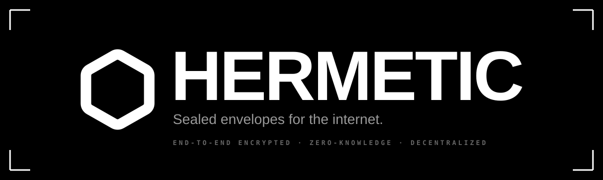

<div align="center">



<br /><br />

**End-to-end encrypted. Zero-knowledge. Decentralized.**
A single app with three ways to seal something — by link, by time, by trust — built so even Hermetic itself cannot read what you seal.

<br />

[](https://nextjs.org)
[](https://react.dev)
[](https://www.typescriptlang.org)
[](https://tailwindcss.com)
[](https://ui.shadcn.com)

[](https://orm.drizzle.team)
[](https://neon.tech)
[](https://vercel.com)
[](https://vitest.dev)

[](https://libsodium.gitbook.io)
[](https://datatracker.ietf.org/doc/html/rfc9106)
[-000000?style=for-the-badge&logoColor=white)](https://en.wikipedia.org/wiki/Shamir%27s_secret_sharing)
[](https://drand.love)
[](https://www.pinata.cloud)
[](./LICENSE)

</div>

<br />

## Three modes. Same encryption.

| Mode | Tagline | Unlock condition |
|------|---------|------------------|
| **🔗 Drop** | _Sealed by link_ | Anyone with the URL fragment can decrypt. The key never reaches the server. |
| **⏳ Capsule** | _Sealed by time_ | Decrypts only after the chosen drand round arrives. Even we cannot open it early. |
| **🔑 Switch** | _Sealed by trust_ | A dead-man's switch. The key is split among `N` trustees; any `K` of them can combine and unlock — but only after the deadline passes. |

The whole product lives in the moment between "I sealed this" and "now it's unlockable." Hermetic gives you three different rules for what makes that moment arrive.

<br />

## How it works

- **End-to-end encrypted** — every byte of content is encrypted in the browser before it touches the network. The server never sees plaintext.
- **Zero-knowledge** — the server holds ciphertext, CIDs, hashed identifiers, and operational timestamps. Never keys. Never content.
- **Decentralized storage** — encrypted blobs live on **IPFS** (pinned via Pinata). Vercel hosts the orchestration; Vercel cannot decrypt anything.
- **No homemade crypto** — every primitive is a thin wrapper over an audited library. AAD-bound envelopes prevent cross-mode and version-downgrade attacks.

A long-form architecture and threat-model writeup is at [`/how-it-works`](./src/app/how-it-works/page.tsx) when running locally, or in:

- [`docs/threat-model.md`](./docs/threat-model.md) — adversaries A–G, what we protect, what we don't, residual risks.
- [`docs/crypto.md`](./docs/crypto.md) — every algorithm, why it was chosen, where it lives.

<br />

## Stack

| Layer | Tech |
|-------|------|
| **Frontend** | Next.js 16 (App Router) · React 19 · shadcn/ui · Tailwind v4 · Lucide icons |
| **Crypto** | libsodium (XChaCha20-Poly1305) · `@noble/hashes` (Argon2id, SHA-256) · `tlock-js` (drand quicknet) · `shamir-secret-sharing` |
| **Storage** | IPFS via **Pinata** · Postgres via **Neon** |
| **Auth** | Magic-link via **Resend** · HS256 JWT in HttpOnly cookie · OPAQUE-blind login (planned v2) |
| **Hosting** | Vercel + Vercel Cron for heartbeat checks |
| **Tooling** | Drizzle ORM · Vitest · ESLint 9 · TypeScript strict |

<br />

## Local development

```bash
git clone https://github.com/pradhankukiran/hermetic
cd hermetic
cp .env.example .env.local
# Fill in DATABASE_URL, PINATA_JWT, PINATA_GATEWAY,
# NEXT_PUBLIC_PINATA_GATEWAY, RESEND_API_KEY, RESEND_FROM_EMAIL,
# AUTH_SECRET (openssl rand -base64 32), CRON_SECRET, NEXT_PUBLIC_APP_URL.
npm install
npm run db:migrate     # apply schema to your Postgres
npm run dev
```

Open `http://localhost:3000`.

### Tests

```bash
npm test               # 47 tests across crypto primitives + envelope AAD binding
```

The crypto layer is covered: XChaCha20-Poly1305 round-trip, AAD-binding rejection (cross-mode + version-downgrade), Argon2id determinism + uniqueness, SHA-256 known-vectors, Shamir 3-of-5 reconstruction, encoding round-trips. Network-touching code (Pinata uploads, drand decryption) is tested manually.

<br />

## Deploy on Vercel

1. Push the repo to GitHub.
2. Import into Vercel — it auto-detects Next.js 16.
3. Provision a **Neon Postgres** database via Vercel Marketplace; copy `DATABASE_URL`.
4. Sign up at **Pinata**, generate a JWT with `files:read,write` scope, set `PINATA_JWT` + `PINATA_GATEWAY` + `NEXT_PUBLIC_PINATA_GATEWAY`.
5. Sign up at **Resend**, verify a sending domain (or use `onboarding@resend.dev` for testing). Set `RESEND_API_KEY` + `RESEND_FROM_EMAIL`.
6. Generate `AUTH_SECRET` and `CRON_SECRET`: `openssl rand -base64 32` (twice).
7. `npm run db:migrate` against the production `DATABASE_URL`.
8. Deploy. **Vercel Cron** is configured in `vercel.json` to call `/api/cron/heartbeat` hourly.

<br />

## Project layout

```
src/
├── app/
│   ├── api/             auth · switches · upload-url · cron handlers
│   ├── auth/            magic-link sign-in
│   ├── capsule/[cid]/   time-locked open page
│   ├── drop/[cid]/      link-based open page
│   ├── switch/[id]/     owner check-in / trustee unlock
│   ├── dashboard/       owned switches
│   ├── how-it-works/    threat-model + crypto choices page
│   └── icon.svg         theme-aware favicon (Hexagon)
├── components/
│   ├── auth/            sign-in / sign-out
│   ├── layout/          Brand · ModeHero · PageHeader · Watermark
│   ├── modes/           Drop · Capsule · Switch UIs
│   └── ui/              shadcn primitives (base-ui under the hood)
└── lib/
    ├── crypto/          libsodium init · symmetric · KDF · Shamir · timelock · hash · random · encoding
    ├── ipfs/            Pinata server client · browser uploader · gateway helpers
    ├── modes/           Drop / Capsule / Switch orchestration (encrypt + envelope)
    ├── db/              Drizzle schema + Neon HTTP client
    ├── email/           Resend wrappers
    └── auth/            JWT signing · session lookup · CSRF
```

<br />

## Security posture

| Threat | Protection |
|--------|------------|
| Curious / malicious server operator | Sees ciphertext + minimal metadata. No keys. No content. |
| Network observer (TLS metadata only) | Already encrypted before TLS; payloads are opaque bytes. |
| Subpoena / court order | We have nothing useful to hand over — and we know that. |
| Single rogue trustee | Holds one Shamir share. Information-theoretically zero leakage. |
| Drand operator compromise | drand quicknet is a t-of-n threshold network; one operator cannot release rounds early. |
| Lost recipient | No back doors. Lost key = lost data. By design. |

**What we don't protect against** is documented honestly in [`docs/threat-model.md`](./docs/threat-model.md): a compromised browser, metadata (timestamps, sizes, hashed emails, plaintext trustee emails for re-notification), pre-trigger trustee collusion, and quantum adversaries against drand timelock.

<br />

## License

MIT.

<br />

<div align="center">
<sub>Built with care for people who actually need their data sealed.</sub>
</div>
